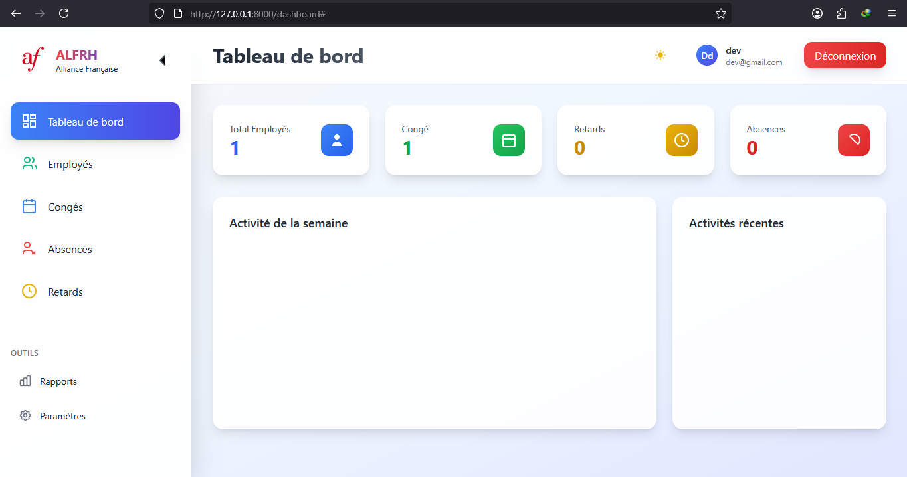
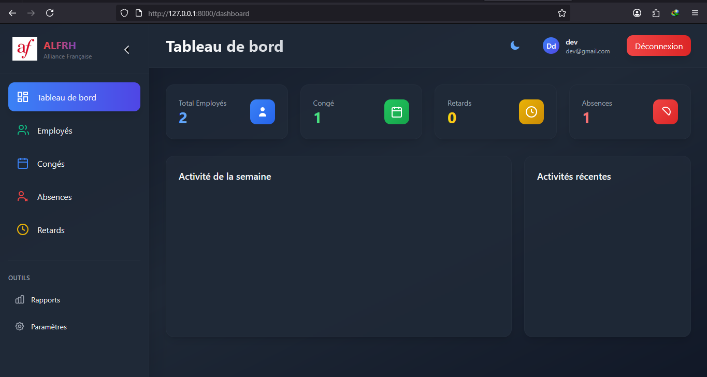
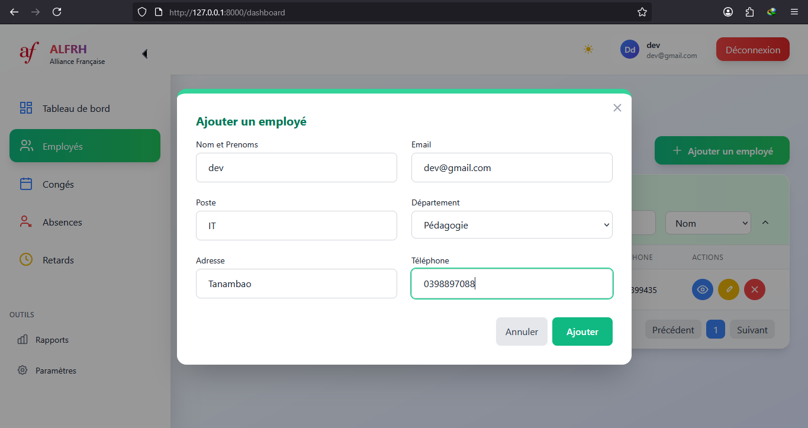
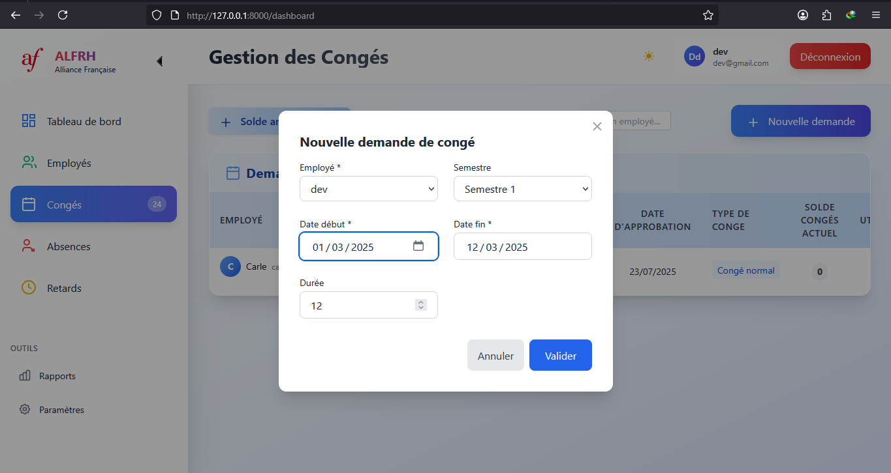
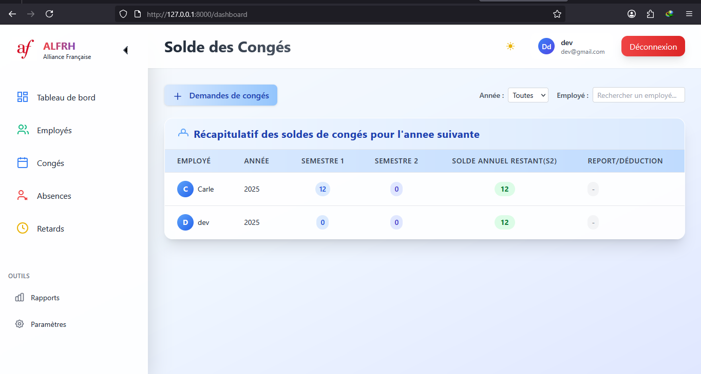
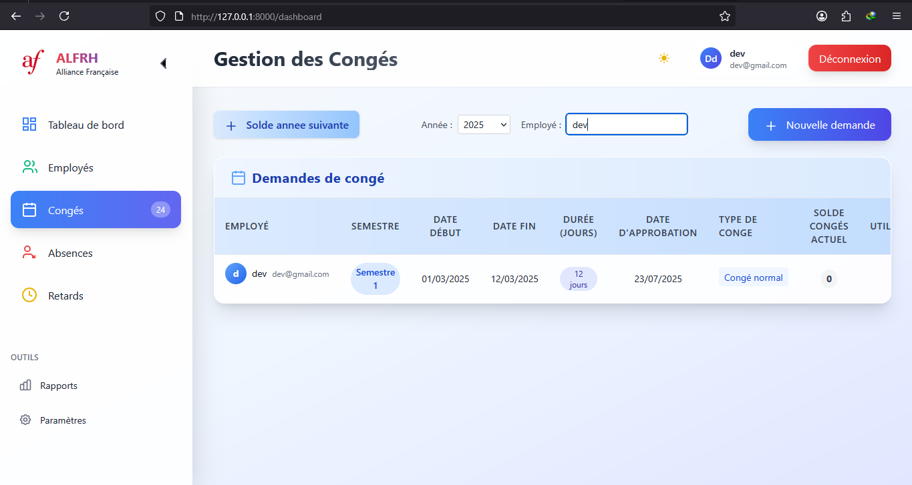
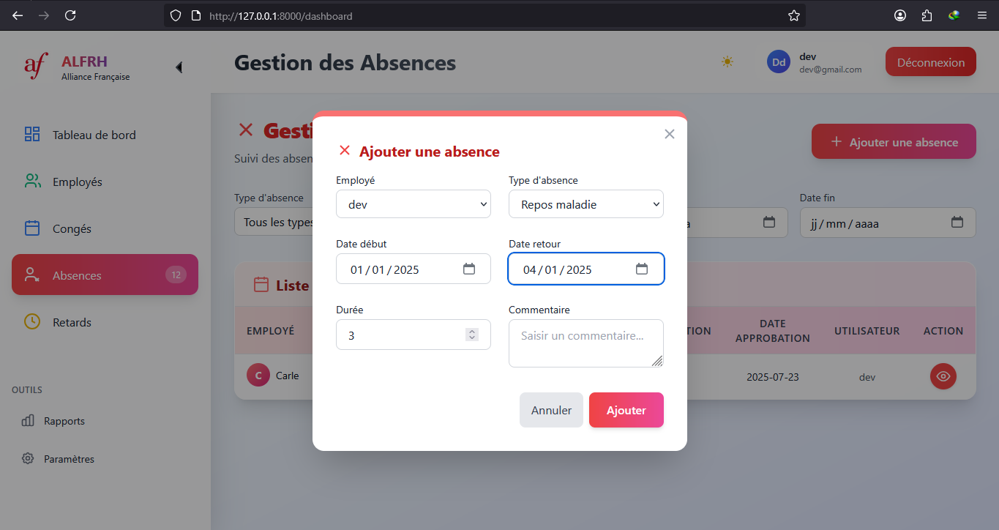
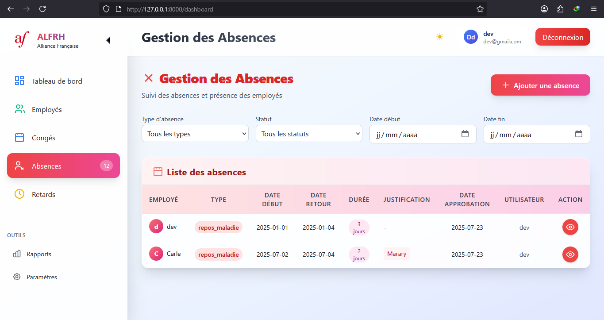

# ALFRH - Application de Gestion des Ressources Humaines

## Présentation
ALFRH est une application web de gestion des ressources humaines permettant de gérer les employés, les absences, les congés, les retards, et d'autres fonctionnalités RH essentielles.

## Requirements du projet

### Fonctionnels
- Gestion des employés (ajout, modification, suppression, consultation)
- Gestion des absences et des retards
- Gestion des demandes et validations de congés
- Tableau de bord RH avec statistiques
- Authentification et gestion des rôles (admin, employé)
- Génération de rapports

### Techniques
- PHP 8+
- Laravel 10+
- Base de données SQLite/MySQL
- Livewire pour les composants dynamiques
- Tailwind CSS pour le design
- Vite pour la gestion des assets

## Installation
1. Cloner le dépôt
2. Installer les dépendances PHP : `composer install`
3. Installer les dépendances JS : `npm install && npm run build`
4. Configurer le fichier `.env`
5. Lancer les migrations : `php artisan migrate`
6. Démarrer le serveur : `php artisan serve`

## Captures d'écran

### Tableau de bord

*Vue d'ensemble des statistiques RH (absences, congés, retards, etc.)*

### Gestion des employés

*Liste des employés avec options d'ajout, modification et suppression.*

### Demande de congé

*Formulaire de demande de congé et historique des demandes.*
### Demande d'absence

## Auteurs
- [Carl randranto]

## Licence
Ce projet est sous licence MIT.
